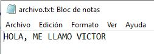
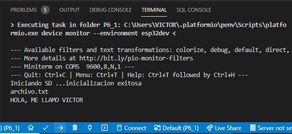
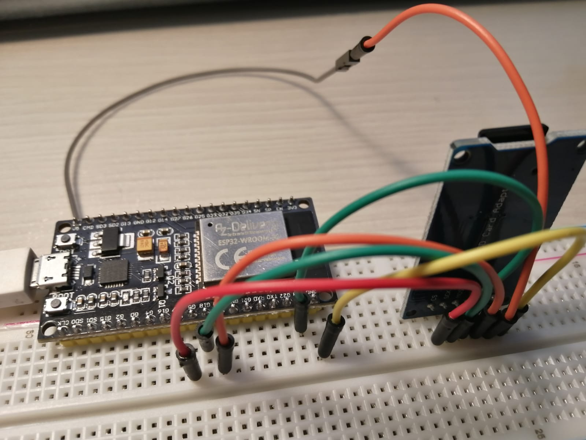

# PRACTICA 6_1  : Buses de comunicación II (SPI)

## 1.Salida del terminal  

## 2.Explicación del funcionamiento

En este ejercicio, se muestra como leer datos de memória de una tarjeta SD mediante buses de comunicación SPI.

El código comienza incializando el bus SPI, codificado, en este caso, en VSPI. Una vez inicializado, creamos la variable "myFile", cuya función es abrir el contenido de la SD, un fichero de texto, por ejemplo. Si todo funciona correctamente, posteriormente se saca por el terminal el contenido de ese archivo de texto, sinó, nos aparecerá por pantalla la línea "Error al abrir el archivo".

## 3.Foto del montaje

